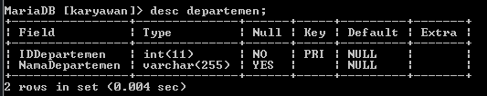
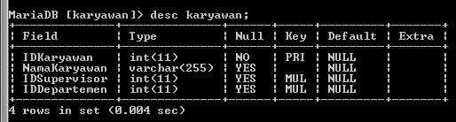
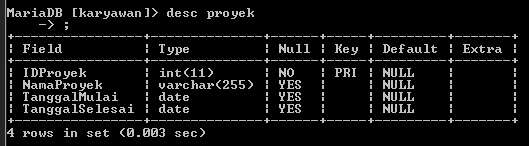
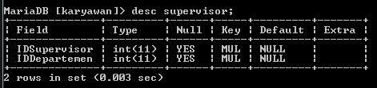
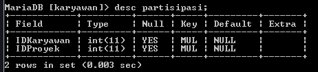
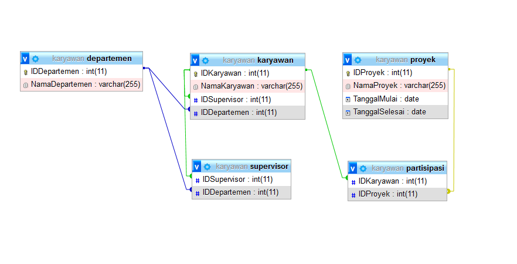

## BASIS DATA KARYAWAN

# TUGAS YANG DI MINTA

1 sebuah perusahaan ingin membuat sistem untuk pengolahan data karyawan pada perusahaan tersebur dengan ketentuan :

- a) Perusahaan tersebut terdiri dari beberapa departemen yang di pimpin oleh seseorang manager

- b) Karyawan bekerja pada salah satu departemen

- c)bKaryawan memiliki atasan langsung supervisor

- d) Supervisor dapat membawahi beberapa karyawan

- e) Setiap karyawan dari lintas departemen dapat bekerja pada satu project yang sama dalam satu waktu

- F) Setiap karyawab dapat mengerjakan beberapa project yang berbeda

2 Buatlah desain databasenya ( ER-Diagram), beserta tabel

# 1 Pengolahan data karyawan

## Table Departemen

# Di bawah ini merupakan perintah dan juga hasil yang di minta

 - CREATE TABLE Departemen (
 IDDepartemen INT PRIMARY KEY,
 NamaDepartemen VARCHAR(255)
 );

## Table Karyawan

# Selanjutnya adalah table karyawan dengan menggunakan perintah seperti di bawah ini beserta hasil 

- CREATE TABLE Karyawan (
IDKaryawan INT PRIMARY KEY,
NamaKaryawan VARCHAR(255),
IDSupervisor INT,
IDDepartemen INT,
FOREIGN KEY (IDSupervisor) REFERENCES Karyawan(IDKaryawan),
FOREIGN KEY (IDDepartemen) REFERENCES Departemen(IDDepartemen)
);

# Table Proyek 

# Kemudian kita akan melanjutkan pada tabel proyek dengan menggunakan perintah sepert di bawah ini beserta hasilnya
- CREATE TABLE Proyek (
IDProyek INT PRIMARY KEY,
NamaProyek VARCHAR(255),
TanggalMulai DATE,
TanggalSelesai DATE
);

# Table Supervisor

# Kemudian kita akan melanjutkan pada tabel supervisor dengan menggunakan perintah sepert di bawah ini beserta hasilnya

- CREATE TABLE Supervisor (
IDSupervisor INT,
IDDepartemen INT,
FOREIGN KEY (IDSupervisor) REFERENCES Karyawan(IDKaryawan),
FOREIGN KEY (IDDepartemen) REFERENCES Departemen(IDDepartemen)
);

# Table Partisipasi

# Kemudian kita akan melanjutkan pada tabel partisipasi dengan menggunakan perintah sepert di bawah ini beserta hasilnya

- CREATE TABLE Partisipasi (
IDKaryawan INT,
IDProyek INT,
FOREIGN KEY (IDKaryawan) REFERENCES Karyawan(IDKaryawan),
FOREIGN KEY (IDProyek) REFERENCES Proyek(IDProyek)
);

# 2 DIAGRAM ERD 

## ERD KARYAWAN

